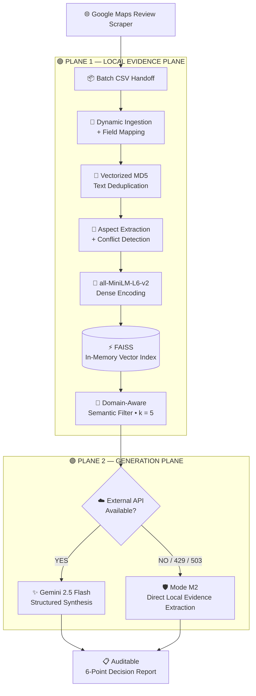

<div align="center">

# 🧠 UIDSS

## Universal Intelligent Decision Support System

### **A Resource-Aware, Evidence-First Retrieval-Augmented Generation Architecture for Cross-Domain Online Reviews**

<br>

<p>
  <b>
    Transforming unstructured Google Maps business reviews into
    verifiable, auditable, and evidence-grounded decision intelligence
    under strict zero-cost infrastructure constraints.
  </b>
</p>

<br>

[](https://www.python.org/)
[](https://github.com/facebookresearch/faiss)
[](https://ai.google.dev/)
[](https://huggingface.co/sentence-transformers/all-MiniLM-L6-v2)
[]()
[]()

<br><br>

### **Evidence before generation. • Retrieval before reasoning. • Reliability before fluency.**

<br>

[📌 Overview](#-overview) •
[🎯 Research Problem](#-research-problem) •
[🏛️ Architecture](#️-system-architecture) •
[⚡ Contributions](#-key-engineering-contributions) •
[📊 Audit](#-comparative-audit) •
[🚀 Setup](#-getting-started) •
[🔬 Case Studies](#-empirical-case-studies) •
[📜 Research](#-citation--research)

</div>

---

# 📌 Overview

**UIDSS (Universal Intelligent Decision Support System)** is an **evidence-first, domain-extensible Retrieval-Augmented Generation (RAG) framework** designed to transform customer-review corpora into structured managerial and consumer decision intelligence.

The core principle is simple:

> **The system should never be more confident than the evidence available to it.**

UIDSS separates retrieval from generation through a **Two-Plane Decoupled Architecture**:

```text
                         UIDSS
                           │
              ┌────────────┴────────────┐
              │                         │
              ▼                         ▼
    ┌────────────────────┐    ┌────────────────────┐
    │  LOCAL EVIDENCE    │    │     GENERATION     │
    │       PLANE        │    │        PLANE       │
    │                    │    │                    │
    │ • Ingestion        │    │ • Gemini 2.5 Flash │
    │ • Deduplication    │    │ • Synthesis        │
    │ • Embeddings       │    │ • Decision Report  │
    │ • FAISS            │    │ • Quota-Aware      │
    │ • Retrieval        │    │                    │
    └─────────┬──────────┘    └─────────┬──────────┘
              │                         │
              └────────────┬────────────┘
                           ▼
                 Evidence-Grounded
                  Decision Support
```

This means **retrieval remains locally available even when the external LLM becomes unavailable**.

Instead of treating an API failure as a total system failure, UIDSS can transition into **Mode M2 — Degraded Evidence Mode**.

---

# 🎯 Research Problem

Online business reviews contain valuable signals about:

* Customer satisfaction
* Service quality
* Cleanliness
* Environment
* Equipment
* Food quality
* Operational complaints
* Conflicting experiences

But raw reviews are difficult to convert into reliable decision intelligence.

A simple keyword-based approach:

```text
Raw Reviews
     ↓
Keyword Search
     ↓
Frequency Counts
     ↓
Basic Summary
```

A cloud-heavy RAG system:

```text
Raw Reviews
     ↓
Cloud Vector Database
     ↓
Cloud LLM
     ↓
Generated Answer
```

UIDSS instead introduces an evidence-processing layer before generation:

```text
Raw Review Corpus
       ↓
Dynamic Ingestion
       ↓
Exact Deduplication
       ↓
Aspect + Conflict Signals
       ↓
Local Dense Embeddings
       ↓
FAISS Retrieval
       ↓
Domain-Aware Filtering
       ↓
Verified Evidence
       │
       ├───────────────┐
       ▼               ▼
   API Available    API Failure
       │               │
       ▼               ▼
    Gemini          Mode M2
       │               │
       └───────┬───────┘
               ▼
     Auditable Decision Report
```

---

# 🧭 Design Philosophy

UIDSS is built around five principles:

| Principle                   | Design Goal                                           |
| --------------------------- | ----------------------------------------------------- |
| 🛡️ **Evidence First**      | Conclusions remain grounded in retrieved evidence     |
| 🏠 **Local First**          | Core retrieval remains locally executable             |
| 🔄 **Graceful Degradation** | API failure should not terminate the pipeline         |
| 🌍 **Domain Extensibility** | Architecture can support multiple review domains      |
| 🔍 **Auditability**         | Evidence, signals, and limitations remain inspectable |

---

# 🏛️ System Architecture

UIDSS uses a **Two-Plane Decoupled Architecture**.



---

# 🏗️ Architectural Decomposition

## 🟢 Plane 1 — Local Evidence Plane

The local plane contains the core evidence-processing infrastructure.

### Dynamic Ingestion

The pipeline does not depend entirely on rigid manual column assignments. Candidate matching and heuristics are used to identify relevant qualitative text fields.

### Exact Content Deduplication

UIDSS applies vectorized MD5 hashing using:

```text
business_name :: review_text
```

This prevents repeated review content from disproportionately affecting retrieval.

### Domain-Aware Routing

Metadata filtering separates domains such as:

```text
domain = gym
domain = restaurant
```

This reduces the possibility of cross-domain evidence contamination.

### Dense Semantic Retrieval

```text
Embedding Model : all-MiniLM-L6-v2
Vector Dimension : 384
Vector Engine    : FAISS
Index Type       : Flat Inner Product
Normalization    : Enabled
Top-k             : 5
```

The retrieval index operates **in memory**, avoiding dependency on a managed cloud vector database.

---

# 🟣 Plane 2 — Generation Plane

When the external API is available:

```text
Retrieved Evidence
       ↓
Gemini 2.5 Flash
       ↓
Structured Synthesis
       ↓
6-Point Decision Report
```

The model is conditioned on retrieved evidence rather than being treated as an unrestricted source of business facts.

The synthesis budget was expanded to **2,048 tokens**, addressing the truncation problem found in the earlier prototype.

---

# ⚡ Key Engineering Contributions

## 01 — 🛡️ Production Resilience

UIDSS introduces an automated degradation mechanism for external API failures.

```text
HTTP 429 → Rate Limit / Quota Exhaustion
HTTP 503 → Service Unavailable
```

Instead of terminating:

```text
API Failure
    ↓
Mode M2
    ↓
Local FAISS Retrieval
    ↓
Top-k Evidence
    ↓
Aspect Signals + Similarity Scores
```

The evidence layer therefore remains operational even when cloud generation is unavailable.

---

## 02 — 🧹 Schema Harmonization

The initial prototype encountered issues including:

```text
ValueError
AttributeError
Nested Series collisions
Incorrect numeric/text interpretation
```

The optimized pipeline introduces candidate matching and string-length heuristics to resolve qualitative text fields more reliably.

---

## 03 — 🔍 Domain Aspect & Conflict Detection

UIDSS extracts domain-specific signals such as:

```text
Quality
Service
Cleanliness
Environment
```

It also examines potential inconsistencies between textual sentiment and star ratings:

```text
Review Text
     │
     ├──────► Sentiment
     │
     └──────► Star Rating
                 │
                 ▼
         Consistency Check
                 │
        ┌────────┴────────┐
        ▼                 ▼
   Consistent       Potential Conflict
```

Examples of investigated signals include:

```text
Hidden Dissatisfaction
Politeness Bias
```

---

## 04 — 🚫 Conservative Evidence Policy

UIDSS distinguishes between:

### Observed Review Evidence

and

### Unobserved Transactional Facts

For example, if the dataset does not establish a verified membership price:

```text
❌ "The monthly fee is ৳2,000."
```

The system should instead abstain:

```text
✓ Pricing information is not established
  by the available review evidence.
```

This makes **abstention preferable to unsupported factual generation**.

---

# 🔄 Mode M1 vs Mode M2

## 🟢 Mode M1 — Full Synthesis

```text
User Query
    ↓
Domain Filtering
    ↓
FAISS Retrieval
    ↓
Top-k Evidence
    ↓
Gemini 2.5 Flash
    ↓
Structured Synthesis
    ↓
Decision Report
```

## 🟠 Mode M2 — Degraded Evidence Mode

Triggered when the external generation layer is unavailable.

```text
User Query
    ↓
Domain Filtering
    ↓
FAISS Retrieval
    ↓
Top-k Evidence
    ↓
Direct Local Evidence
    ↓
Evidence + Aspect Signals
+ Similarity Scores
```

### Key architectural distinction

> **Generation can degrade. Evidence retrieval does not have to.**

---

# 📊 Comparative Audit

The optimized implementation addresses concrete weaknesses identified in the initial prototype.

| Dimension            | Initial Prototype                                            | Optimized Implementation                  |
| -------------------- | ------------------------------------------------------------ | ----------------------------------------- |
| **Ingestion**        | Nested Series collisions and unreliable field interpretation | Dynamic candidate resolution + heuristics |
| **Deduplication**    | No structural deduplication                                  | Vectorized MD5 content hashing            |
| **Vector Storage**   | ChromaDB file-lock issues in Colab                           | In-memory FAISS                           |
| **Domain Isolation** | Mixed sources without domain tagging                         | Metadata-driven routing                   |
| **Fault Tolerance**  | Pipeline could crash on `429/503`                            | Automatic Mode M2 fallback                |
| **Token Budget**     | ~700 tokens; possible truncation                             | 2,048-token synthesis                     |
| **Evidence Policy**  | Higher inference risk                                        | Conservative evidence boundary            |

---

# 📉 Deduplication Impact

One of the measurable improvements is the reduction of redundant documents before indexing.

```text
             RAW REVIEW DATA
                    │
                    ▼
              1,210 Records
                    │
                    ▼
           Vectorized MD5 Hash
                    │
                    ▼
              379 Unique
               Documents
```

This means repeated review content is removed before semantic retrieval.

---

# 🎯 Retrieval Pipeline

```text
Review Corpus
     ↓
all-MiniLM-L6-v2
     ↓
384-D Normalized Vectors
     ↓
FAISS Inner-Product Search
     ↓
Domain-Aware Filtering
     ↓
Top-k = 5
     ↓
Verified Evidence
```

The resulting retrieval layer is:

* Local
* Lightweight
* Inspectable
* Cloud-vector-database independent

---

# 📋 Decision Report

The generation layer is designed around a structured **6-point executive synthesis**:

```text
┌─────────────────────────────────────────┐
│         UIDSS DECISION REPORT           │
├─────────────────────────────────────────┤
│ 01 │ Executive Summary                  │
│ 02 │ Key Findings / Detected Aspects    │
│ 03 │ Positive Evidence                  │
│ 04 │ Negative / Conflicting Evidence    │
│ 05 │ Limitations / Confidence           │
│ 06 │ Grounded Evidence References       │
└─────────────────────────────────────────┘
```

The goal is not simply to generate a fluent answer, but to produce a result that remains connected to the evidence used to construct it.

---

# 🚀 Getting Started

## 1. Clone

```bash
git clone https://github.com/your-username/UIDSS-Optimized-Pipeline.git
cd UIDSS-Optimized-Pipeline
```

## 2. Install Dependencies

```bash
pip install sentence-transformers faiss-cpu google-genai pandas numpy
```

## 3. Prepare Dataset

```text
UIDSS-Optimized-Pipeline/
│
├── dhaka_gym.csv
├── dhaka_restaurants.csv
└── UIDSS_Master_Pipeline.ipynb
```

## 4. Run

Open:

```text
UIDSS_Master_Pipeline.ipynb
```

Execution flow:

```text
Cell 0
  ↓
Dependencies

Cell 1
  ↓
Ingestion
  ↓
Deduplication
  ↓
Aspect Extraction
  ↓
FAISS Index

Cell 2
  ↓
Gemini Configuration
  ↓
Interactive Querying
```

The implementation is designed for **Google Colab or local Python environments**.

---

# 🔐 API Configuration

The generation plane requires a Gemini API key.

Example:

```bash
GEMINI_API_KEY="your_api_key"
```

**Never commit API credentials to the repository.**

The local retrieval plane remains independent from the external generation layer.

---

# 🔬 Empirical Case Studies

## 🏋️ Case Study A — Gym Recommendation

### Query

> **"Which gym is best in Dhaka for personal workout and good environment?"**

UIDSS identifies the target domain and retrieves evidence around:

```text
Cleanliness
Environment
Equipment
Customer Service
```

The recorded synthesis prioritizes:

```text
Aamra Active
Dhaka Gym
```

based on retrieved operational evidence.

The system also reports uncertainty around personal trainer availability because the relevant evidence is split across Nakhalpara branches.

### What makes the result useful?

```text
Recommendation
      +
Detected Aspects
      +
Limitations
      +
Confidence
      +
Evidence Records
```

Rather than presenting a recommendation without context.

---

## 🛡️ Case Study B — HTTP 429 Resilience

A resilience audit was performed after the free-tier Gemini quota was exhausted.

Instead of terminating:

```text
Gemini API
    │
    X
    │
 HTTP 429
    │
    ▼
 Mode M2
    │
    ▼
Local FAISS Evidence
```

The system exposed local evidence containing fields such as:

```text
Business
Rating
Retrieval Score
Aspect Signals
Conflict Flag
Review Evidence
```

The recorded audit reports:

> **Operational Continuity: 100% Preserved without Runtime Crash**

This demonstrates the distinction between **generation-layer failure** and **retrieval-layer availability**.

---

# 🌍 Cross-Domain Design

The architecture is designed to operate across multiple review domains.

Current demonstrated domains:

```text
              UIDSS
                │
        ┌───────┴────────┐
        │                │
        ▼                ▼
    🏋️ GYMS        🍽️ RESTAURANTS
        │                │
        ▼                ▼
    Equipment          Food
    Trainers           Service
    Environment        Cleanliness
    Cleanliness        Environment
```

The retrieval architecture remains shared while domain-specific aspects and metadata routing can vary.

Potential future domains include:

```text
🏨 Hotels
🏥 Healthcare Services
🎓 Universities
🛒 E-commerce
✈️ Travel
🏠 Real Estate
🏢 Consumer Services
```

These represent **architectural extension targets**, not claims of current implementation.

---

# 🧪 Research Evaluation

UIDSS can be evaluated across multiple dimensions rather than answer fluency alone.

### Retrieval

```text
Precision@k
Recall@k
Semantic Relevance
Aspect Coverage
```

### Evidence Grounding

```text
Evidence Completeness
Provenance Preservation
Unsupported Claim Rate
Conflict Preservation
```

### Generation

```text
Faithfulness
Relevance
Consistency
Decision Usefulness
```

### Reliability

```text
429 Recovery
503 Recovery
Fallback Success
Pipeline Continuity
```

### Resource Efficiency

```text
Memory Consumption
Index Construction Time
Retrieval Latency
External API Dependency
Infrastructure Cost
```

---

# 📦 Resource-Aware Infrastructure

UIDSS deliberately avoids requiring:

```text
❌ Managed Vector Database
❌ Dedicated Retrieval Server
❌ Expensive Cloud Compute
❌ High-Tier LLM Infrastructure
```

Instead:

```text
┌──────────────────────────────────┐
│          LOCAL MACHINE           │
│                                  │
│ Python                           │
│ Pandas                           │
│ Sentence Transformers            │
│ FAISS                            │
│ Data Processing                  │
│ Evidence Retrieval               │
└────────────────┬─────────────────┘
                 │
                 ▼
        Optional External LLM
```

This makes the core retrieval architecture suitable for experimentation under strict resource constraints.

---

# ⚠️ Limitations

UIDSS is a research-oriented implementation.

### Review Bias

Online reviews represent individual experiences and may not perfectly represent the underlying business.

### Evidence Coverage

The system cannot establish facts absent from the available review corpus.

### Domain Specificity

Aspect extraction currently relies partly on domain-specific lexical signals.

### External Generation

Full synthesis still depends on external LLM availability.

### Data Quality

Scraped review datasets may contain duplicates, incomplete information, inconsistent ratings, or noisy narratives.

---

# 📈 Research Roadmap

### ✅ Milestone 1

**Vectorized MD5 Exact-Text Deduplication Engine**

### ✅ Milestone 2

**Metadata-Driven Pre-Retrieval Domain Routing**

### ✅ Milestone 3

**Degraded Operating Mode — Mode M2**

### ⏳ Milestone 4

**Streaming scraper integration with dynamic index refreshment**

### ⏳ Milestone 5

**On-premise Small Language Model (SLM) integration for 100% offline synthesis**

The first three milestones are implemented; the latter two remain future work.

---

# 🔮 Future Research

```text
                    UIDSS
                      │
          ┌───────────┼───────────┐
          │           │           │
          ▼           ▼           ▼
      Streaming    Local SLM   Dynamic
      Retrieval    Generation  Indexing
          │           │           │
          └───────────┼───────────┘
                      ▼
              Fully Local / Hybrid
              Decision Intelligence
```

Potential directions include:

* Streaming data ingestion
* Dynamic index refresh
* On-premise SLM integration
* Fully offline synthesis
* Advanced evidence verification
* Larger cross-domain evaluation
* Reliability benchmarking

---

# 🧠 Core Reliability Principle

<div align="center">

## **When evidence disappears, confidence must disappear with it.**

</div>

The UIDSS philosophy can therefore be summarized as:

```text
Retrieve what exists.
        ↓
Verify what was retrieved.
        ↓
Preserve conflicting evidence.
        ↓
Avoid unsupported claims.
        ↓
Degrade gracefully when infrastructure fails.
```

---

# 🏆 What UIDSS Demonstrates

UIDSS combines:

```text
Semantic Retrieval
        +
Local Vector Search
        +
Domain Routing
        +
Evidence Constraints
        +
Conflict Signals
        +
Structured Generation
        +
Fault Tolerance
        +
Graceful Degradation
```

The result is **not simply a chatbot over reviews**.

It is an **evidence-processing and decision-support architecture** designed to keep its evidence layer operational even when its generation layer is unavailable.

---

# 📜 Citation & Research

If you use UIDSS or its architectural framework in academic or research work:

```bibtex
@article{jahan2026uidss,
  title={UIDSS: A Resource-Aware Evidence-First Retrieval-Augmented Decision Support Architecture for Cross-Domain Online Business Reviews},
  author={Jahan, Nusrat},
  journal={Department of Computer Science and Engineering, United International University},
  year={2026}
}
```

The citation metadata is taken from the supplied project README.

---

# 🤝 Contributing

Research-oriented contributions are welcome in areas such as:

* Retrieval evaluation
* Evidence verification
* Hallucination mitigation
* Domain adaptation
* Local LLM integration
* Benchmark development
* Fault-tolerance testing
* Resource optimization

Please open an issue before making major architectural changes.

---

# 📄 License

This project is released under an **Academic Research License**.

Please review the repository license before using the implementation for commercial purposes.

---

<div align="center">

<br>

# 🧠 UIDSS

### **Evidence before generation.**

### **Retrieval before reasoning.**

### **Reliability before fluency.**

<br>

**A resource-aware architecture for evidence-grounded decision intelligence.**

<br>

⭐ **Star the repository if you find the architecture interesting.**

</div>
