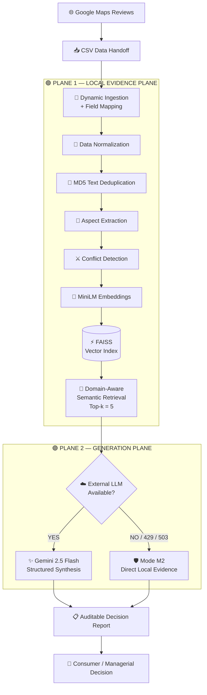

<div align="center">

# 🧠 UIDSS

## Universal Intelligent Decision Support System

### **Evidence-First • Resource-Aware • Cross-Domain • Auditable RAG**

<p>
  <b>Turning unstructured customer reviews into verifiable, evidence-grounded decision intelligence — without expensive infrastructure.</b>
</p>

<br/>

[](https://www.python.org/)
[](https://github.com/facebookresearch/faiss)
[](https://ai.google.dev/)
[](https://huggingface.co/sentence-transformers/all-MiniLM-L6-v2)
[]()
[]()

<br/><br/>

**A zero-cost, resource-aware RAG architecture for trustworthy decision support from online reviews.**

<br/>

[📌 Overview](#-overview) •
[🎯 Research Problem](#-research-problem) •
[🏛️ Architecture](#️-system-architecture) •
[⚙️ Pipeline](#️-end-to-end-pipeline) •
[🧠 Intelligence Layer](#-intelligence-layer) •
[🛡️ Reliability](#️-reliability--failure-resilience) •
[📊 Evaluation](#-empirical-evaluation) •
[🚀 Getting Started](#-getting-started) •
[🔬 Case Studies](#-empirical-case-studies) •
[📜 Research](#-research-direction)

---

### 🔎 At a Glance

| Dimension               |                 UIDSS                |
| :---------------------- | :----------------------------------: |
| **Retrieval**           |              100% Local              |
| **Vector Database**     |                 FAISS                |
| **Embedding Model**     |           all-MiniLM-L6-v2           |
| **Generation**          |           Gemini 2.5 Flash           |
| **Data Source**         |          Google Maps Reviews         |
| **Domains**             |             Cross-Domain             |
| **Failure Mode**        |      Evidence-First Degradation      |
| **Infrastructure Cost** |                **$0**                |
| **Primary Goal**        | **Verifiable Decision Intelligence** |

</div>

---

# 📌 Overview

**UIDSS (Universal Intelligent Decision Support System)** is a **resource-aware, evidence-first Retrieval-Augmented Generation (RAG) architecture** designed to transform large collections of unstructured online reviews into structured, auditable, and decision-oriented intelligence.

The system is designed around a simple principle:

> **A decision-support system should never be more confident than its evidence.**

Instead of treating an LLM as the source of truth, UIDSS establishes a strict separation between:

**Evidence → Retrieval → Verification → Synthesis → Decision**

This architectural separation allows the system to remain useful even when the external LLM becomes unavailable, rate-limited, or unreliable.

---

# 🎯 Research Problem

Traditional review-analysis systems usually fall into one of two extremes:

### ❌ Conventional Keyword Analytics

```text
Reviews
   ↓
Keyword Matching
   ↓
Frequency Counts
   ↓
Basic Statistics
```

Fast, but unable to understand semantic meaning, conflicting opinions, or contextual relationships.

---

### ❌ Conventional LLM-RAG

```text
Reviews
   ↓
Vector Database
   ↓
Cloud LLM
   ↓
Generated Answer
```

More intelligent, but often dependent on:

* Expensive infrastructure
* External API availability
* API quotas
* Cloud vector databases
* Large models
* Continuous internet connectivity

More importantly, a generated answer can still introduce **unsupported claims**.

---

### ✅ UIDSS Approach

```text
                 ┌─────────────────────────┐
                 │     Raw Review Corpus    │
                 └────────────┬────────────┘
                              ↓
                 ┌─────────────────────────┐
                 │ Evidence Normalization  │
                 └────────────┬────────────┘
                              ↓
                 ┌─────────────────────────┐
                 │ Semantic Retrieval      │
                 │       (Local)           │
                 └────────────┬────────────┘
                              ↓
                 ┌─────────────────────────┐
                 │ Evidence Verification   │
                 └────────────┬────────────┘
                              ↓
                    ┌─────────┴─────────┐
                    │                   │
              API Available        API Unavailable
                    │                   │
                    ↓                   ↓
             LLM Synthesis       Direct Evidence
                    │                   │
                    └─────────┬─────────┘
                              ↓
                 ┌─────────────────────────┐
                 │ Auditable Decision      │
                 │        Report           │
                 └─────────────────────────┘
```

---

# 💡 Core Philosophy

UIDSS is built around **five engineering principles**:

### 1. Evidence First

Every generated conclusion must originate from retrieved evidence.

### 2. Local First

The expensive and latency-sensitive retrieval layer remains completely local.

### 3. Graceful Degradation

External API failure should reduce system sophistication — **not destroy system functionality**.

### 4. Domain Extensibility

The architecture should work across domains without redesigning the entire pipeline.

### 5. Auditability

A user should be able to understand **why** the system reached a particular conclusion.

---

# 🏛️ System Architecture

UIDSS uses a **Two-Plane Decoupled Architecture**.



---

# 🔬 Why Two Planes?

The system deliberately separates **retrieval** from **generation**.

### Plane 1 — Evidence Plane

Runs locally.

```text
Data
 ↓
Cleaning
 ↓
Deduplication
 ↓
Aspect Analysis
 ↓
Embeddings
 ↓
FAISS
 ↓
Semantic Retrieval
```

**No external LLM is required.**

---

### Plane 2 — Generation Plane

Uses the retrieved evidence for natural-language synthesis.

```text
Retrieved Evidence
        ↓
   Gemini API
        ↓
Structured Report
```

If the API becomes unavailable:

```text
Retrieved Evidence
        ↓
   Mode M2
        ↓
Direct Evidence Output
```

This creates a crucial property:

> **The system loses generation capability before it loses evidence access.**

---

# ⚙️ End-to-End Pipeline

UIDSS follows a multi-stage evidence processing pipeline.

```text
┌──────────────────┐
│  Review Corpus   │
└────────┬─────────┘
         ↓
┌──────────────────┐
│ Data Ingestion   │
└────────┬─────────┘
         ↓
┌──────────────────┐
│ Field Mapping    │
└────────┬─────────┘
         ↓
┌──────────────────┐
│ Text Deduplication│
└────────┬─────────┘
         ↓
┌──────────────────┐
│ Aspect Extraction│
└────────┬─────────┘
         ↓
┌──────────────────┐
│ Conflict Analysis│
└────────┬─────────┘
         ↓
┌──────────────────┐
│ Dense Embeddings │
└────────┬─────────┘
         ↓
┌──────────────────┐
│ FAISS Retrieval  │
└────────┬─────────┘
         ↓
┌────────────────────────┐
│ Evidence Safety Filter │
└────────────┬───────────┘
             ↓
       ┌─────┴─────┐
       ↓           ↓
   Gemini       Mode M2
       ↓           ↓
       └─────┬─────┘
             ↓
┌────────────────────────┐
│ Decision Intelligence  │
└────────────────────────┘
```

---

# 🧠 Intelligence Layer

UIDSS is not simply a vector-search wrapper.

The system introduces multiple reasoning-oriented components between retrieval and generation.

---

## 🔹 1. Dynamic Field Mapping

The ingestion layer is designed to tolerate variations in review datasets.

Instead of requiring one rigid schema:

```text
review
rating
author
date
```

UIDSS can dynamically identify relevant fields before indexing.

This allows the same retrieval architecture to operate across multiple datasets.

---

## 🔹 2. MD5-Based Text Deduplication

Duplicate review text is detected before embedding.

```text
Raw Reviews
     │
     ├── Review A
     ├── Review B
     ├── Review A  ← Duplicate
     └── Review C
             ↓
        MD5 Hashing
             ↓
     Unique Evidence
```

Benefits:

* Lower embedding cost
* Smaller index
* Less redundant evidence
* Reduced retrieval noise

---

## 🔹 3. Aspect Extraction

Reviews are transformed from generic text into decision-relevant aspects.

Examples:

```text
Restaurant
 ├── Food
 ├── Service
 ├── Cleanliness
 ├── Price
 └── Atmosphere

Gym
 ├── Equipment
 ├── Trainer
 ├── Cleanliness
 ├── Crowd
 └── Membership Experience
```

This allows the system to answer **aspect-specific questions** instead of simply retrieving generally similar reviews.

---

## 🔹 4. Conflict Detection

Real-world reviews frequently disagree.

For example:

```text
Reviewer A:
"Very clean and well maintained."

Reviewer B:
"The equipment area was dirty."

Reviewer C:
"Clean overall, but the washroom needs improvement."
```

A naive summarizer may produce:

> "The gym is clean."

UIDSS instead attempts to preserve the disagreement.

```text
Overall Cleanliness
        │
        ├── Positive Evidence
        │
        ├── Negative Evidence
        │
        └── Localized Conflict
```

This is critical for decision support because **conflicting evidence is itself information**.

---

# 🎯 Semantic Retrieval

UIDSS uses:

### Embedding Model

`all-MiniLM-L6-v2`

### Vector Engine

`FAISS`

### Retrieval Strategy

**Domain-aware Top-k semantic retrieval**

Default:

```text
k = 5
```

Conceptually:

```text
User Query
     ↓
Query Embedding
     ↓
FAISS Similarity Search
     ↓
Top-k Evidence
     ↓
Domain / Aspect Filtering
     ↓
Verified Evidence Set
```

Unlike keyword search:

```text
"good equipment"
```

semantic retrieval can identify conceptually related evidence such as:

```text
"The machines are modern and there
is enough equipment for most workouts."
```

---

# 🛡️ Evidence Safety & Hallucination Control

One of the central goals of UIDSS is **not merely generating fluent answers, but preventing unsupported claims**.

The system establishes a strict boundary:

```text
                 ┌───────────────────────┐
                 │     Retrieved Facts   │
                 └───────────┬───────────┘
                             ↓
                  ┌─────────────────────┐
                  │ Evidence Validation │
                  └──────────┬──────────┘
                             ↓
              ┌──────────────┴──────────────┐
              │                             │
          Supported                     Unsupported
              │                             │
              ↓                             ↓
         Can Generate                 Must Not Claim
```

For example, if the review corpus does **not** contain verified pricing:

❌ The system should not invent:

> "The monthly membership costs ৳2,000."

Instead:

✅ It should state that pricing information is unavailable from the evidence corpus.

This principle can be summarized as:

> **Absence of evidence is not permission to generate a fact.**

---

# ☁️ Quota-Aware Generation

Cloud APIs are inherently unreliable from the perspective of a local research prototype.

Possible failures include:

```text
HTTP 429 → Rate Limit
HTTP 503 → Service Unavailable
Network Failure
API Timeout
Quota Exhaustion
```

UIDSS therefore implements **Mode M2 — Evidence Degradation**.

---

## 🔄 Mode M1 — Full Synthesis

When the external API is available:

```text
Retrieved Evidence
        ↓
Gemini 2.5 Flash
        ↓
Structured Reasoning
        ↓
6-Point Decision Report
```

---

## 🛡️ Mode M2 — Local Evidence Fallback

When the API is unavailable:

```text
Retrieved Evidence
        ↓
Evidence Extraction
        ↓
Direct Local Output
```

The system remains operational.

### Failure does not become total failure.

Instead:

```text
Normal
████████████████████  Full Intelligence

API Failure
██████████████░░░░░░  Evidence Intelligence
```

This is an important distinction between **availability degradation** and **system failure**.

---

# 📋 Auditable Decision Reports

UIDSS produces a structured **6-point decision report** rather than an unrestricted conversational answer.

A typical report can organize evidence around:

```text
┌────────────────────────────────────┐
│       UIDSS DECISION REPORT        │
├────────────────────────────────────┤
│ 01. Overall Assessment             │
│ 02. Key Positive Evidence          │
│ 03. Key Negative Evidence          │
│ 04. Aspect-Level Findings          │
│ 05. Conflicting Evidence           │
│ 06. Final Decision Guidance        │
└────────────────────────────────────┘
```

This structure makes the output easier to:

* Audit
* Compare
* Reproduce
* Evaluate
* Present to decision-makers

---

# 📊 Comparative Audit

UIDSS was designed to improve upon conventional review-analysis pipelines.

| Capability           | Keyword Analytics | Basic RAG | UIDSS |
| -------------------- | :---------------: | :-------: | :---: |
| Semantic Retrieval   |         ❌         |     ✅     |   ✅   |
| Local Retrieval      |         ⚠️        |     ❌     |   ✅   |
| Aspect Awareness     |         ❌         |     ⚠️    |   ✅   |
| Conflict Detection   |         ❌         |     ⚠️    |   ✅   |
| Evidence Boundary    |         ❌         |     ⚠️    |   ✅   |
| API Failure Handling |         ❌         |     ❌     |   ✅   |
| Zero-Cost Retrieval  |         ⚠️        |     ❌     |   ✅   |
| Cross-Domain Design  |         ⚠️        |     ⚠️    |   ✅   |
| Direct Evidence Fa   |                   |           |       |
